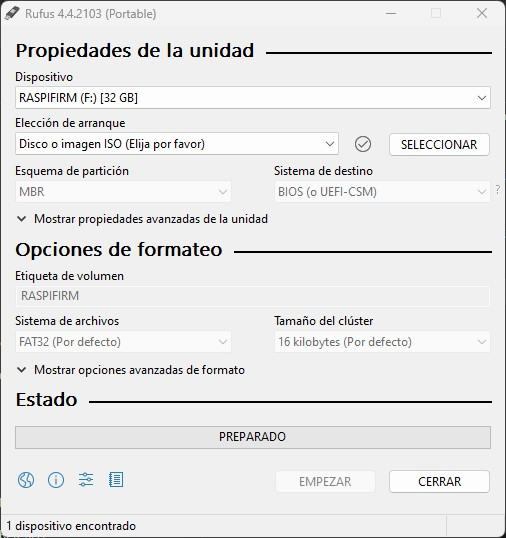
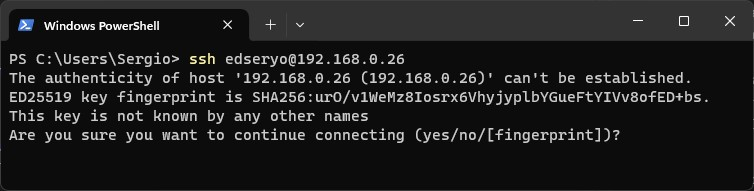
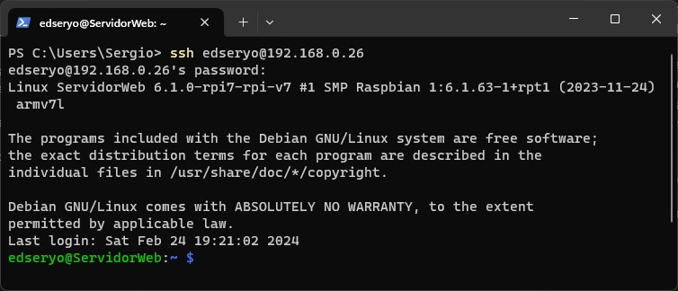
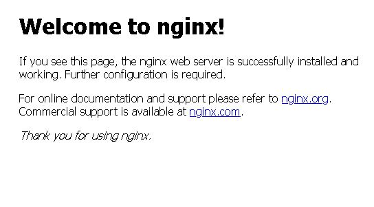
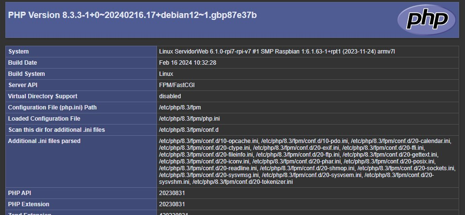

# Puesta en marcha de una Raspberry Pi 3 en un servidor web

## Introduccion

Para empezar debemos tener varios componentes
- **Raspberry Pi 3** (o cualquier otra, pero lo vamos hacer con esta, vale?). Si vamos hacer un tutorial de este cacharro es normal que necesitemos el aparato.

    

- **Tarjeta microSD**. Es donde vamos a instalar el sistema operativo y los archivos de la web. Una tarjeta de mala calidad es posible que nos joda bastante el desarrollo. No compre una china de aliexpress o muy barata (al menos que encuentres una buena oferta)

    

- Teclado. Las primeras configuraciones la haremos directamente en la raspberry y para esto es necesario un teclado conectado por usb.

    

- **Fuente de alimentación y cable de alimentacion**. Si no alimentamos la raspberry no creo que podamos hacerla funcionar. Ya sabes **si no hay chicha no hay salchicha**.

    

- **Cable de red**. Esto es opcional. La propia raspberry tiene una tarjeta de red inalambrica que podemos configurar (lo haremos), pero si queremos lo podemos conectar directamente por cable de red y ahorrarnos todo eso de configuracion de red.

    

- **Lector de tarjeta**. Bueno esto depende de si tienes lector de tarjeta SD en tu ordenador o no. Es posible que necesites un adaptador de microSD a SD Card.

    


## Los Pasos

Ha continuacion vamos a ir desarrollando los diferentes pasos. 

Aquí intentaré poner un indice

Preparación SD
Conexiones
Primera Configuración
Instalación Nginx
Instalación PHP
Instalación MariaDB
Instalación PhpMyAdmin

### Preparación SD

El primer paso de todo este rollo es preparar la microSD que va a tener la raspberry. Vamos a instalar una un sistema Debian modificado para Raspberry Pi. Desde este [enlace](https://www.raspberrypi.com/software/operating-systems/) podemos descargar la última version o una que queramos. Para desarrollar un servidor liviano que no tengamos muchas tareas y mierdas que nos den por culo la mejor opcion es **Raspberry Pi OS Lite**. Descargamos el archivo correspodiente y descomprimimos. Al final tendremos un archivo **"\*.img"**. Para copiar los datos a la tarjeta microSD, metemos esta en el lector de tarjetas en su ranurita correspodiente (si queda holgada o no entra, digamos que esa no es el agujero por donde debes meterla) y este al ordenador.

Una vez introducida la tarjeta y conectado el lector de tarjetas al ordenador tendremos un nuevo volumen en el mismo. En Windows (paso de Linux para hacer el manual, por ahora, porque más tarde vamos a estar trabajando en Linux). Ahora es cuando necesitaremos un programa para copiar la imagen a la tarjeta. Lo normal es utilizar [Win32DiskImagen](https://sourceforge.net/projects/win32diskimager/), pero en el momento de realiazar este tutorial/manual da fallo sobre windows 10 (ya os veo riendo los proLinux), por tanto, vamos a utilizar [Rufus](https://rufus.ie/es/) que su utilización es más amplia.

Abrimos **Rufus** y nos aparecerá la siguiente imagen.


Y ahora vamos a prepararlo.
1. En dispositivo vamos a seleccionar la unidad donde tengamos montado la tarjeta microSD
2. Para seleccionar la imagen pulsamos seleccionar y elegimos la imagen donde la tengamos guardado
3. Cuando tengamos seleccionado nos mostrara en *eleccion de arranque* los datos del archivo
4. En principio no tenemos que hacer nada más. Podemos observar el resto de datos
5. Una vez todo en orden pulsamos en **Empezar** aceptamos la diferentes ventanas que nos salen para indicarnos que vamos a formatear y perder todos los datos (**ATENCION** Si no queremos perder los datos, cancelamos la operacion. Halla tú)
6. Cuando todo esté listo nos dará un mensaje de que la operación ha concluido.

Bueno ya tenemos lista la tarjeta.

### Conexiones.

En este apartado vamos a conectar la raspberry completamente

El esquema sería algo así:


y las conexiones serían las siguientes:
1. Alimentacion. Corriente, chicha.
2. PCIO (na, olvidalos de esto, no lo vamos a utilizar)
3. Teclado. Va a los puertos USB
4. Raton. Va a los puertos USB (esto... tampoco lo vamos a utilizar, lo pongo por la foto)
5. Router. Con el cable de red nos conectamos entre el dispositivos
6. Pantalla, monitor o televisor. el que gustes.

En definitiva no vas a poder euivocarte. Cada conexión es diferente y no puedes entrar (no pongo la mano en el fuego, que por el mundo hay de todo) un conector en su lugar no correspondiente. En el caso de los USB puedes poner donde te plazca los dispositivos.

### Primera configuración.

La primera configuración será con la configuración básica de raspberry. Para ello encendemos el aparato.

Lo primero que veremos será letras por todas partes, propio de los sistemas linux, un pantallazo azul, y mas letras. Abrá un momento que tendremos un pantallazo azul donde nos pedirá que introduzcamo el idioma del teclado. Seleccionamos el nuestro (o el chino, yo no soy tu)

Seguidamente nos pedirá que introduzcamo un usuario con el que queramos trabajar y después su contraseña, con su confirmación.

Y finalmente ya estamos en la consola de comando esperando que introduzcamo el fantastico usuario y contraseña que hemos creado.

A partir de aqui vamos a trabajar con comandos y el primero será:

``` bash
sudo raspi-config
```

Nos aparecerá otra pantalla azul con valias opciones.

Lo primero será activar el **ssh**. Con *ssh* nos podemos conectar remotamente a la raspberry, es decir, desde nuestro ordenador vamos a poder conectarnos al cacharro y poder configurarlo (a mi me va a ayudar a hacer algunas capturas). Para ello nos vamos a la opcion *"3. Interface Options -> I1 SSH"*. Nos pedirá una confirmación de aceptación y listo.
Abrimos la consola de comando (powershell, tilix la que queramos) y escribimos lo siguiente

```bash
ssh usuario@192.168.0.x
```

Donde pone usuario, pone tu usuario y despues de "@" va la direccion del cacharro (es verdad, se me olvidó con el comando "ip a" podrás obtenerla, la introduces ante de entrar en la configuracion)

La primera vez nos pedirá confirmación de marca escribimos "yes"



Despues pedirá la contraseña y una vez introducido ya estaremos conectado.



volvemos abrir la configuración de raspberry y esta vez elegiremo *"expandir sistema"* que en micaso está en *"6. Advance Options -> A1. Expand Filesystem"*. Con esto utilizaremos todo el espacio de la microSD.

En cuanto termine salimos pulsando finish y ya en la linea de comando escribimos 

```bash
sudo reboot
```

Esto nos reiniciará el cacharro, pero nos provocará que nos desconectemos por ssh. Esperamos un par de minutos y volvemos a entrar. Una vez dentro escribimos

```bash
sudo apt update 
sudo apt upgrade -y
```

Esto nos actualizará los repositorios bases del sistema

#### Configuración Wi-Fi

En la configuración de la raspberry podemos configurar la red Wi-Fi. Para eso vamos a *"1. System Options -> S1. Wireless Lan"* y seguimos por la interfaz.
1. Seleccionamos de donde somo (ES)
2. Introducimos la SSID de nuestra red
3. Introducimos la clave de la Wi-Fi

y listo. Con el comando *"ip a"* vemos que todo está bien.

### Instalación Nginx

Vamos a utilizar **Nginx** como servidor web. Podríamos utilizar apache, pero vamos a utilizar esto. Y, ¿por qué? Porqueeee... eso es un trabajo para clase de informática que no vamos a explicar. Vale con que vamos a instalarlo. Para ello utilizamos las siguientes líneas de comando.

```bash
# instalamos los paquetes necesarios para añadir repositorios externos
sudo apt install -y curl gnupg2 ca-certificates lsb-release debian-archive-keyring
# Importamos la clave GPG del repositorio externo desde donde descargarnos la última versión de Nginx
sudo curl -fsSL https://nginx.org/keys/nginx_signing.key | gpg --dearmor -o /etc/apt/trusted.gpg.d/nginx.gpg
# Añadimos el repositorio externo en cuestión y confirmamos que el repositorio está disponible tras actualizar las fuentes
sudo echo "deb http://nginx.org/packages/debian $(lsb_release -sc) nginx" | tee /etc/apt/sources.list.d/nginx.list > /dev/null
# Actualizamos el sistema y lo dejamos preparado para instalar Nginx
sudo apt update
# Instalamos Nginx
sudo apt install -y nginx
```
> **NOTA**
> Si cuando entramos algún comando y no nos acepta, es decir, nos da fallo por falta de permiso podemos hacer varias cosas:
> 1. Añadir al usuario al grupo de sudo con
>   ```bash
>   sudo usermod -aG sudo <nombre_de_usuario>
>   ```
> 2. Usar root. Para ello entramos con:
>   ```bash
>   sudo su
>   ```

Finalmente si todo ha salido bien ponemos en el navegador la direccion ip del cacharro y tendremos una pantalla de bienvenida de nginx.



### Instalacion PHP

Ya tenemos nuestro servidor web. Ahora necesitamos un servidor de aplicaciones. Para ello vamos a instlar el **PHP-FPM**. Para eso volvemos a introducir comandos.

```bash
sudo apt update
# Instalamos los paquetes necesarios para añadir repositorios externos:
sudo apt install -y lsb-release ca-certificates apt-transport-https software-properties-common gnupg2
# Importamos la clave GPG del repositorio externo desde donde descargarnos la última versión de PHP-FPM:
sudo curl -fsSL  https://packages.sury.org/php/apt.gpg | gpg --dearmor -o /etc/apt/trusted.gpg.d/sury.gpg
# Añadimos el repositorio externo en cuestión:
sudo echo "deb https://packages.sury.org/php/ $(lsb_release -sc) main" | tee /etc/apt/sources.list.d/sury-php.list
# Confirmamos que el repositorio está disponible tras actualizar las fuentes:
sudo apt update
# Instalar php
sudo apt install -y php8.3-fpm
```

Dado que PHP-FPM se instala en el sistema como un servicio, podemos comprobar su estado utilizando service:

```bash
#para comprobar el estado
service php8.3-fpm status

# Para iniciar el servicio
service php8.3-fpm start
```

Ha sido facil, ¿Verdad? Pues no. Ahora toca modificar cosas. Tenemos que configurar *Nginx* para que funcione *PHP*. Para ello modificamos el archivo **www.conf** introduciendo los siguientes comandos:

```bash
nano /etc/php/8.3/fpm/pool.d/www.conf

# buscamos y modificamos las siguientes líneas:
...
user = tuUsuario
group = tuUsuario
...
listen.owner = tuUsuario
listen.group = tuUsuario
#(donde pone tuUsuario debes poner tu usuario, con el que estás trabajando)
```
> **NOTA**
> El usuario normal de nginx es "nginx".

Ahora tenemos que modificar los la configuración del servidor. Con esto vamos a poner que coga primero una pagína web php y vamos a configurar el servidor php. Para ello hacemos lo siguiente:

```bash
# Modificamos el siguiente archivo
sudo nano /etc/nginx/conf.d/default.conf

# Y dejamos el siguiente contenido
server {
    listen       80;
    listen  [::]:80;
    
    # Lugar donde están los archivos de servidor
    root   /usr/share/nginx/html;

    # Información de datos del servidor
    location / {
        # orden de busqueda de pagina de inicio
        index  index.php index.html index.htm;
    }

    location ~ \.php$ {
        root           /usr/share/nginx/html;
        fastcgi_pass   unix:/var/run/php/php8.3-fpm.sock;
        fastcgi_index  index.php;
        index          index.php;
        include        fastcgi_params;
        fastcgi_param  SCRIPT_FILENAME   $document_root$fastcgi_script_name;
    }
}

# Modificamos el siguiente archivo
sudo nano /etc/nginx/nginx.conf

# y modificamos la primera línea
user tuUsuario;

```

Ahora solo falta comprobar la configuración y reiniciar el servicio de *Nginx*

```bash
# comprobar el servicio
sudo nginx -t

# Si todo está ok, reiniciar servicio
sudo service nginx restart
```

Ya solo queda crear un *"index.php"* y probar que todo funciona. Para ello:

```bash
# Creamos el archivo index.php
sudo nano /usr/share/nginx/html/index.php

# y lo modificamos con
<?php
    echo phpinfo();
?>
```

Y si todo ha ido bien cuando pongamos de nuevo la direccion ip en nuestro navegador tendremos un fascinante información de ¡¡¡ PHP !!! Yuju!



### Instalacion MariaDB

Lo siguiente en la lista es instalar una base de datos. Tenemos varios, pero una muy extendida y, mas o menos, facil de utilizar es **MariaDB**, además de que es libre y está basado en *MySQL*

Para instalarlo introducimos el siguiente comando

```bash
sudo apt-get update

sudo apt-get install mariadb-server mariadb-client
```

Después de que se complete la instalación, procedemos a hacerla un poco mas segura:

```bash
sudo mysql_secure_installation
```
Esto nos hará una serie de preguntas para la seguridad de la base de datos. Contesta a gusto. Pero la primera es importante. Si le pones contraseña al root, acuerdate de ella.

Para probar y preparar nuestro servidor, es bueno dejar las opciones por defecto y el usuario root sin contraseña, pero al final, cuando liberes el servidor para que todo el mundo se conecte, no seas tonto y pon un usuario y contraseña que sea dificil de averiguar y bloquea el usuario root.

### Instalación PhpMyAdmin

Con nuestra base de datos ya instalada vamos a instalar un gestor de la misma. Ya que tenemos un servidor web y un servicio php, porqué no vamos a instalar un sistema que podamos utilizar ambos? Pues eso. **PHPMYADMIN**. Para ello escribimos:

```bash
sudo apt install phpmyadmin -y --no-install-recommends
sudo apt install -y phpmyadmin php-mbstring php-zip php-gd php-json php-curl
```
Durante el proceso, ya al final nos preguntará que si queremos que PhpMyAdmin administre la base de datos y la contraseña de la base de datos.

El proceso de instalación añade el archivo de configuración de phpMyAdmin de Apache al directorio /etc/apache2/conhable/, donde se lee de forma automática. Para terminar de configurar Apache y PHP a fin de que funcionen con phpMyAdmin, la única tarea que queda a continuación en esta sección del tutorial es habilitar explícitamente la extensión PHP mbstring. Esto se puede hacer escribiendo lo siguiente:

```bash
sudo phpenmod mbstring
```

A continuación, reinicie Nginx para que sus cambios surtan efecto:

```bash
sudo systemctl restart nginx
```

phpMyAdmin ahora está instalado y configurado para funcionar 

Ya solo queda introducir en nuestro navegador:

```bash
ipCacharro/phpmyadmin
```

Y.... ahora puede ocurrir dos cosas una buena y otra no tan buena

Si ocurre la buena nos aparecerá directamente PhpMyAdmin sin problemas


Si nos ocurre lo no tan bueno, nos saldrá un 404 en toda regla. Para esto tenemos que añadir un archivo de configuración. Para ello modificamos archivo de configuración de nginx con los siguientes códigos

```bash
sudo nano /etc/nginx/conf.d/default.conf

#insertamos el siguiente código en él
location /phpmyadmin {
    root /usr/share/;
    index index.php index.html index.htm;
    location ~ ^/phpmyadmin/(.+\.php)$ {
      try_files $uri =404;
      fastcgi_pass unix:/run/php/php8.3-fpm.sock;
      fastcgi_index index.php;
      fastcgi_param SCRIPT_FILENAME $document_root$fastcgi_script_name;
      include /etc/nginx/fastcgi_params;
     }
     location ~* ^/phpmyadmin/(.+\.(jpg|jpeg|gif|css|png|js|ico|html|xml|txt))$ {
       root /usr/share/;
     }
  }

# y reiniciamo el servidor
sudo service nginx restart
```

y ya tendremos el primer caso


https://www.digitalocean.com/community/tutorials/how-to-install-and-secure-phpmyadmin-on-ubuntu-20-04-es


https://pedropablomoral.com/raspberrypi/proyectos/servidor-casero/